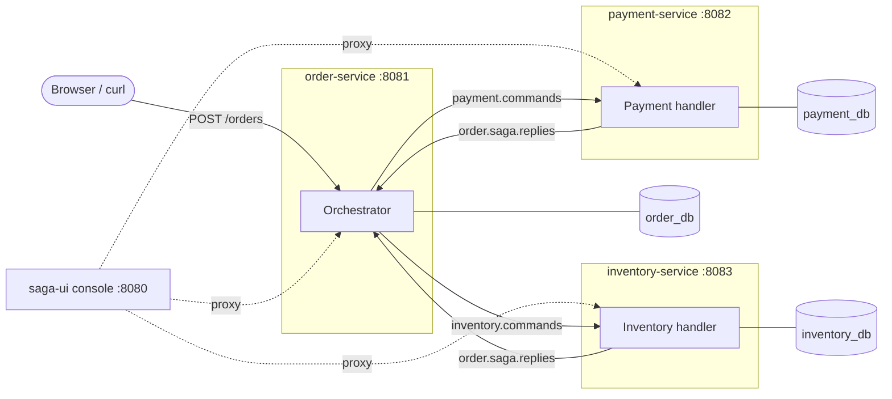

# SAGA: an order saga on Kafka

When a customer places an order here, three independent services must agree: **order-service** records it, **payment-service** charges the customer, and **inventory-service** reserves stock. Each service has its own database, so no single database transaction can cover all three. Instead the order runs as a **saga**: a sequence of local transactions coordinated by messages. If a later step fails, earlier steps are undone by **compensations** (a charge is refunded, a reservation released).

This project is a working, tested implementation of that pattern, including the failure handling a real system needs:

- **Transactional outbox:** no message is lost or sent for a rolled-back change.
- **Idempotent consumers:** duplicates are harmless.
- **Retries with backoff and dead-letter topics,** with replay.
- **Timeouts:** a participant that never answers doesn't hang an order.
- **Fencing:** late messages can't charge or reserve for an order that was already cancelled.
- **Alerting and manual resolution** for compensations that keep failing.
- **OAuth2/JWT security with Keycloak**: roles for viewers, operators and admins, and audit records of who did what.
- **A browser console** that shows each saga live and can call every endpoint.

Java 21 · Spring Boot 4.0.6 · PostgreSQL 17 · Kafka 4.0 · Maven multi-module · Windows CMD

## The picture



order-service is the **orchestrator**. It decides the next step and sends commands; the other two only do what they're told and reply.

## Quick start (CMD)

Prerequisites: JDK 21, Maven 3.9+, Docker Desktop running. Details in [Getting started](docs/GETTING-STARTED.md).

```
docker compose up -d
mvn clean install -DskipITs
start "order"     java -jar order-service\target\order-service-0.0.1-SNAPSHOT.jar
start "payment"   java -jar payment-service\target\payment-service-0.0.1-SNAPSHOT.jar
start "inventory" java -jar inventory-service\target\inventory-service-0.0.1-SNAPSHOT.jar
start "console"   java -jar saga-ui\target\saga-ui-0.0.1-SNAPSHOT.jar
start http://localhost:8080
```

The console asks you to sign in through Keycloak. Use `admin` / `admin` to run everything; `operator` and `viewer` have fewer rights. Admin endpoints need a token: `call ops\token.cmd admin admin`, then `curl -H "Authorization: Bearer %TOKEN%" …`. See [Getting started §4](docs/GETTING-STARTED.md#4-sign-in-users-roles-and-tokens).

In the console, click **Happy path**, then **Out of stock**, and compare the two routes on the state map. To see the raw Kafka messages behind them, open **AKHQ** at http://localhost:8086; `docker compose up -d` starts it along with Postgres and Kafka.

## Documentation

Read in this order if you are new:

| Doc | What it gives you |
|---|---|
| [Getting started](docs/GETTING-STARTED.md) | Install, build, run, reset, test, inspect databases and Kafka, troubleshoot |
| [Architecture](docs/ARCHITECTURE.md) | Why a saga, how the pieces fit, every reliability mechanism and the failure modes it covers |
| [Scenarios](docs/SCENARIOS.md) | A hands-on lab of 14 scenarios, from the happy path to stuck compensations, each with steps, expected results and the code responsible |
| [Codebase tour](docs/CODEBASE.md) | Modules, packages, one order traced through the classes, where everything lives, how to extend it |
| [Runbook](ops/RUNBOOK.md) | Operator procedures for alerts, stuck sagas and dead letters |
| [Project log](PROJECT.md) | Status, decisions, configuration and endpoint reference, Boot 4 gotchas, open work |

## Repository layout

```
saga-common/        shared library: message contracts, outbox, idempotency, Kafka error handling, DLT replay
order-service/      REST API + saga orchestrator + timeouts + stuck-compensation alerting + interventions
payment-service/    charges and refunds customer credit
inventory-service/  reserves and releases stock
saga-ui/            browser console (proxy + Kafka message injector + single-page UI)
saga-e2e/           Testcontainers end-to-end tests that run the real jars
ops/                Prometheus alert rules (+ tests) and the operator runbook
docker/, docker-compose.yml   local Postgres, Kafka, AKHQ (Kafka web UI on :8086) and Keycloak (:8180, realm in docker/keycloak/)
```

> **Security:** admin and seed endpoints and the console are protected with OAuth2/JWT (Keycloak). The identity setup is **development-grade**: Keycloak dev mode, dev users and secrets. See "Next / open" in [PROJECT.md](PROJECT.md).
