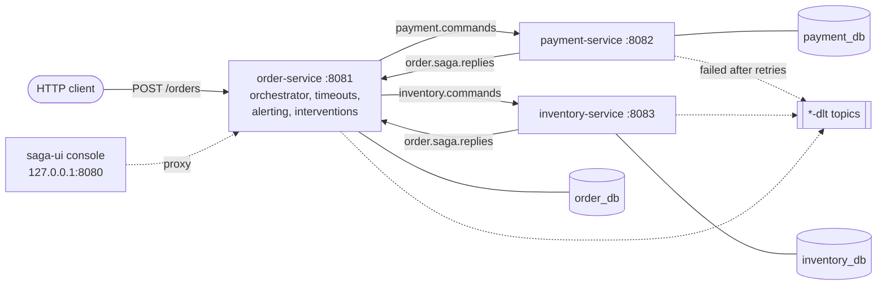
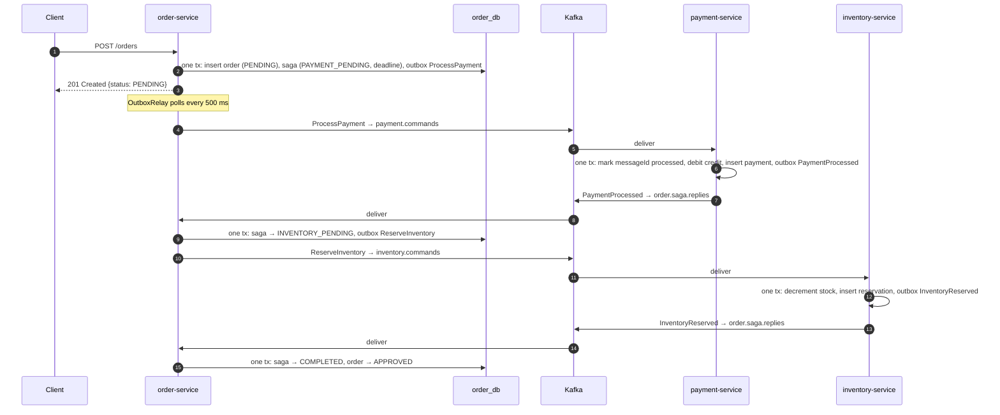
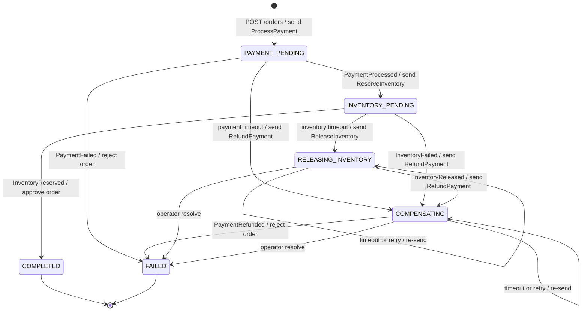

# Architecture

This document explains **what** the system does, **why** it is built this way, and **which code** implements each part. For hands-on exploration, pair it with [Scenarios](SCENARIOS.md). For a class-by-class tour, see [Codebase](CODEBASE.md).

- [1. The problem a saga solves](#1-the-problem-a-saga-solves)
- [2. System overview](#2-system-overview)
- [3. The happy path, message by message](#3-the-happy-path-message-by-message)
- [4. The saga state machine](#4-the-saga-state-machine)
- [5. Reliability building blocks](#5-reliability-building-blocks)
- [6. Failure modes](#6-failure-modes)
- [7. Data model](#7-data-model)
- [8. Operability](#8-operability)
- [9. Key decisions and trade-offs](#9-key-decisions-and-trade-offs)

---

## 1. The problem a saga solves

Placing an order touches three pieces of state owned by three services:

| Service | Owns | Must do |
|---|---|---|
| order-service | orders | record the order, decide its outcome |
| payment-service | customer credit, payments | charge the customer (and refund if needed) |
| inventory-service | product stock, reservations | reserve stock (and release if needed) |

Each service has **its own database**: that's what keeps services independent. The price is that no single ACID transaction can span all three. A two-phase commit across services and Kafka would couple them tightly and block on any participant failure.

A **saga** replaces the one big transaction with a sequence of **local transactions**, one per service, connected by messages. Each step commits on its own. If a later step fails, the saga runs **compensating transactions** for the steps already done. A refund doesn't erase the original charge; it is a new, opposite action, and both are recorded.

This gives **eventual consistency**. For a short time the customer may be charged for an order that's about to be rejected; the saga guarantees it ends consistent: either approved, or rejected with everything undone.

### Orchestration rather than choreography
There are two ways to coordinate a saga:
- **Choreography:** each service reacts to the others' events. There's no central brain, so the flow is implicit and spread across services.
- **Orchestration** (used here): one component, the **orchestrator** in order-service, holds the saga state and tells each participant what to do with **commands**. Participants answer with **replies**.

Orchestration keeps the whole flow in one place (`OrderSagaOrchestrator`), so it's easy to read, test and extend. Timeouts and operator interventions also have an obvious home. Payment and inventory stay simple: they know nothing about each other or about sagas.

---

## 2. System overview

Every arrow between services is a Kafka topic: 3 partitions, keyed by orderId, written via each service's outbox ([5.1](#51-transactional-outbox)). The console also proxies to payment and inventory (not drawn).

| Component | Port | Role |
|---|---|---|
| order-service | 8081 | REST API, saga orchestrator, timeouts, alerting metrics, interventions |
| payment-service | 8082 | Executes ProcessPayment / RefundPayment |
| inventory-service | 8083 | Executes ReserveInventory / ReleaseInventory |
| saga-ui | 8080 (localhost only) | Browser console. Proxies to the services and injects raw Kafka messages |
| PostgreSQL 17 | 5432 | One instance, three databases (`order_db`, `payment_db`, `inventory_db`), one per service |
| Kafka 4.0 (KRaft) | 9092 | Three topics plus three dead-letter topics |
| saga-common | – | A library jar used by all three services (not a process) |

**Topics**

| Topic | Producer | Consumer | Messages |
|---|---|---|---|
| `payment.commands` | order | payment | `ProcessPayment`, `RefundPayment` |
| `inventory.commands` | order | inventory | `ReserveInventory`, `ReleaseInventory` |
| `order.saga.replies` | payment, inventory | order | `PaymentProcessed`, `PaymentFailed`, `PaymentRefunded`, `InventoryReserved`, `InventoryFailed`, `InventoryReleased` |
| `<topic>-dlt` | Spring Kafka error handler | `dlt` replay endpoint | messages that failed all retries |

The messages are Java records in two sealed interfaces: [`SagaCommand`](../saga-common/src/main/java/com/saga/common/messaging/SagaCommand.java) and [`SagaReply`](../saga-common/src/main/java/com/saga/common/messaging/SagaReply.java). Every message carries `sagaId` and `orderId`.

---

## 3. The happy path, message by message

Things to notice:

1. **The HTTP call returns immediately** with `PENDING`. The outcome arrives about a second later (`GET /orders/{id}`).
2. **Every arrow out of a service starts life as a row in that service's `outbox` table**, written in the same transaction as the business change. Nothing calls Kafka directly from business code.
3. **Every step on a receiving side is one database transaction.** It covers recording the message as processed, the business change, and the outgoing reply.

On a real run this whole flow takes about 0.5–1.5 s locally. You can watch it in the console's message timeline ([Scenario 1](SCENARIOS.md#scenario-1--happy-path)).

---

## 4. The saga state machine

The saga's state lives in the `order_saga` table ([`OrderSaga`](../order-service/src/main/java/com/saga/order/saga/OrderSaga.java)). Transitions happen only in [`OrderSagaOrchestrator`](../order-service/src/main/java/com/saga/order/saga/OrderSagaOrchestrator.java) and in [`SagaInterventionService`](../order-service/src/main/java/com/saga/order/saga/intervention/SagaInterventionService.java) (operator actions).

Labels read `event / action`. "Retry" and "resolve" are operator actions (section 8).

Rules that keep it safe:

- **Guarded transitions.** Each reply type is only valid in one state (`expectedState` in the orchestrator). A reply that arrives in any other state (late, duplicate, out of order) is logged with `Saga … in state … ignoring …` and dropped. Transition methods on `OrderSaga` also throw if called from the wrong state.
- **Every non-terminal state has a deadline.** Missing it triggers the timeout transitions above ([section 5.6](#56-timeouts)).
- **Compensating states never give up on their own.** Refunding and releasing must eventually succeed, so a timeout there re-sends the command. If that keeps happening, an alert fires and an operator steps in ([section 8](#8-operability)).
- **The order's status follows the saga:** `PENDING` until the saga is terminal, then `APPROVED` (COMPLETED) or `REJECTED` (FAILED) with a `rejectionReason`.

---

## 5. Reliability building blocks

Each subsection gives the **problem**, the **mechanism**, and **where it lives**.

### 5.1 Transactional outbox
**Problem.** "Update the database, then send to Kafka" has two failure windows. The DB commits but the send fails, so the message is lost. Or the send succeeds but the DB rolls back, so you've announced something that never happened.

**Mechanism.** Business code never sends to Kafka. It inserts the message into an `outbox` table **in the same transaction** as the business change ([`OutboxWriter.write`](../saga-common/src/main/java/com/saga/common/outbox/OutboxWriter.java)). `Propagation.MANDATORY` makes it fail if called outside a transaction. A scheduled [`OutboxRelay`](../saga-common/src/main/java/com/saga/common/outbox/OutboxRelay.java), every 500 ms:
1. locks up to 100 unpublished rows with `SELECT … FOR UPDATE SKIP LOCKED`,
2. sends them all and waits for every acknowledgement,
3. marks them `published_at` and commits.

If any send fails, the transaction rolls back and the whole batch is retried on the next tick. Delivery is therefore **at-least-once**: a message can be sent twice, never zero times. That's why consumers must be idempotent (5.2).

`SKIP LOCKED` lets several instances of a service relay in parallel without double-sending the same row. With one instance per service, per-key order is preserved; with several, it becomes best-effort.

### 5.2 Idempotent consumers
**Problem.** At-least-once delivery means duplicates. Kafka redelivers after a crash or rebalance, and the outbox may re-send after a partial failure. Processing a ProcessPayment twice would charge twice.

**Mechanism.** Two layers:
1. **Message-level.** Every message has a unique `messageId` header (the outbox row id). Each handler first calls [`IdempotencyGuard.firstDelivery`](../saga-common/src/main/java/com/saga/common/idempotency/IdempotencyGuard.java), which runs `INSERT INTO processed_message … ON CONFLICT DO NOTHING`.
   - If 0 rows are inserted, the message was seen before and the handler returns.
   - The insert is in the **same transaction** as the handler's work. If the handler fails, the marker rolls back too and the redelivery is processed properly.
2. **Business-key level.** Participants also key on the order: `payment.order_id` and `reservation.order_id` are unique. A second ProcessPayment for an order that's already paid replies `PaymentProcessed` without charging again, even if it has a new `messageId` (for example, re-sent by a timeout).

[Scenario 5](SCENARIOS.md#scenario-5--duplicate-deliveries-are-harmless) shows both layers.

### 5.3 Wire format and type registry
- **Value:** JSON (Jackson 3 `JsonMapper`).
- **Headers:** `messageId` (UUID) and `messageType` (the record's simple name, e.g. `ProcessPayment`).
- **Codec:** [`MessageCodec`](../saga-common/src/main/java/com/saga/common/messaging/MessageCodec.java) builds its name-to-class registry from the sealed interfaces' `getPermittedSubclasses()`. A new message type is just a new record in `SagaCommand` or `SagaReply`. The orchestrator's `switch` over `SagaReply` is exhaustive, so the compiler points you to every place that must handle it.
- **Malformed input:** a missing header, unknown type or unparseable JSON throws `NonRetryableMessageException` (see 5.5).

### 5.4 Ordering per order
All messages for an order use `orderId` as the Kafka key. Kafka keeps order **within a partition**, and a key always maps to the same partition, so for one order:
- the refund that a timeout sends is always processed **after** the original charge command;
- the release is always processed after the reserve.

That is what makes "compensate unconditionally" safe (5.6). Topics have 3 partitions, and each service runs 3 consumer threads (`spring.kafka.listener.concurrency: 3`), one per partition. A problem on one partition doesn't stall the others.

### 5.5 Retries, dead-letter topics and replay
**Problem.** Some failures are transient (DB hiccup, lock timeout) and succeed on retry. Others never will (a malformed message, or a bug for that input). Retrying the second kind forever blocks the partition behind it: a *poison message*.

**Mechanism** ([`KafkaErrorHandlingConfig`](../saga-common/src/main/java/com/saga/common/kafka/KafkaErrorHandlingConfig.java)):
- Spring Kafka's `DefaultErrorHandler` retries **in place** with exponential backoff. The default is 4 retries at 0.5 s, 1 s, 2 s and 4 s (about 7.5 s), configurable under `saga.kafka.retry.*`.
- After the last retry, the record is published to **`<topic>-dlt`** on the same partition. It keeps its key, value and headers, plus `kafka_dlt-*` headers describing the exception.
- `NonRetryableMessageException` and Jackson parse errors skip retries and go straight to the DLT.
- Each failed attempt logs `Delivery attempt N failed …` (WARN). Each dead-letter logs `Dead-lettered …` (ERROR).
- Retries are **blocking**: the partition waits. That preserves per-order ordering (5.4) at the cost of delaying other orders on that partition for up to ~7.5 s. Non-blocking retry topics were rejected because they reorder messages for the same order.

**Replay** ([`DltEndpoint`](../saga-common/src/main/java/com/saga/common/kafka/dlt/DltEndpoint.java), [`DltReplayer`](../saga-common/src/main/java/com/saga/common/kafka/dlt/DltReplayer.java)): once the cause is fixed, `POST /actuator/dlt/{topic}` re-publishes pending dead letters to the original topic.
- **Scope:** each service can only replay the DLTs of topics it consumes.
- **Progress tracking:** replay progress is the committed offset of a dedicated consumer group `<app>-dlt-replay`, so nothing is replayed twice by the tool. Replay is still safe to repeat, because the `messageId` is unchanged and consumers are idempotent.
- **Headers:** the old `kafka_dlt-*` headers are stripped and a `dltReplayCount` header is incremented.

### 5.6 Timeouts
**Problem.** If a participant is down or a message is stuck, the saga would wait forever and the customer's money or stock would stay held.

**Mechanism.**
- **Deadlines:** every non-terminal saga state carries a `deadline` (`saga.timeout.payment` / `.inventory` / `.compensation`, default 30 s each).
- **Scanner:** [`SagaTimeoutScanner`](../order-service/src/main/java/com/saga/order/saga/SagaTimeoutScanner.java) runs every 5 s, finds overdue sagas, and calls `OrderSagaOrchestrator.onTimeout` for each one in its own transaction:

| Timed out in | Becomes | Sends |
|---|---|---|
| PAYMENT_PENDING | COMPENSATING, reason "Payment timed out" | RefundPayment |
| INVENTORY_PENDING | RELEASING_INVENTORY, reason "Inventory timed out" | ReleaseInventory |
| RELEASING_INVENTORY / COMPENSATING | same state, new deadline, `compensation_resends + 1` | the same compensation again |

**A timeout compensates unconditionally.** The orchestrator can't know whether the participant is dead or just slow. It doesn't need to: the compensation is queued behind the original command on the same partition (5.4).
- If the slow charge eventually happens, the refund right behind it undoes it.
- If it never happens, the refund finds nothing to undo and still replies.

Either way the saga ends FAILED with nothing held. The late success reply (`PaymentProcessed` after the saga moved on) is dropped by the state guard. [Scenario 8](SCENARIOS.md#scenario-8--payment-timeout-with-a-real-outage) shows this with payment-service actually stopped.

Keep step timeouts well above the retry budget (~7.5 s), so a participant that is merely retrying isn't timed out.

### 5.7 Compensations and tombstone fencing
**Problem.** Ordering by key covers the normal case, but a command can still arrive *after* its saga has been compensated. For example, a ProcessPayment that was dead-lettered and is replayed hours later would charge a customer for a cancelled order.

**Mechanism.** Compensations leave a **tombstone** when there is nothing to undo:
- RefundPayment with no payment on record inserts a `payment` row with status `CANCELLED` (no customer, no amount).
- ReleaseInventory with no reservation inserts a `reservation` row with status `RELEASED`.

A later ProcessPayment or ReserveInventory for that order finds the tombstone and is **refused** (`PaymentFailed "Order already CANCELLED"` / `InventoryFailed "Order already released"`). Refund and release are themselves idempotent: refunding something already refunded is a no-op that still replies, so the saga never hangs.

Code: [`PaymentCommandHandler.process/refund`](../payment-service/src/main/java/com/saga/payment/PaymentCommandHandler.java) and [`InventoryCommandHandler.reserve/release`](../inventory-service/src/main/java/com/saga/inventory/InventoryCommandHandler.java). [Scenario 10](SCENARIOS.md#scenario-10--fencing-a-late-command-is-refused) shows it.

### 5.8 Concurrency control
- **Pessimistic row locks** (`SELECT … FOR UPDATE`) on `customer_credit`, `product`, `payment` and `reservation` serialize work on the same customer, product or order. Ten concurrent orders for 50 units of stock reserve exactly 50 ([Scenario 4](SCENARIOS.md#scenario-4--ten-orders-race-for-the-same-stock)).
- **Optimistic locking** (`@Version`) on `orders` and `order_saga` makes a reply, a timeout and an operator action on the same saga mutually exclusive. The loser gets an optimistic-lock failure:
  - a Kafka reply is retried and then hits the state guard;
  - the scanner re-evaluates on its next tick;
  - the operator gets HTTP 409.

---

## 6. Failure modes

| What fails | What happens | How it resolves |
|---|---|---|
| order-service crashes after committing an order, before the relay sends | The outbox row stays unpublished | Sent on restart; the saga continues |
| A relay sends, then crashes before marking rows published | The rows are re-sent on the next tick | Duplicates are absorbed by idempotency (5.2) |
| **Kafka down** | Orders are still accepted (outbox fills up). The relay blocks up to the producer's `max.block.ms` (60 s) per attempt on the shared scheduler thread, delaying timeout scans | Everything is sent when Kafka returns. Timeouts can't be acted on during the outage anyway, since compensations couldn't be sent |
| **payment-service or inventory-service down** | Commands wait in Kafka. The saga times out and compensates | On restart the participant processes the original command, then the compensation behind it, and the saga ends FAILED with nothing held ([Scenario 8](SCENARIOS.md#scenario-8--payment-timeout-with-a-real-outage), [9](SCENARIOS.md#scenario-9--inventory-timeout-and-release)) |
| order-service down | Replies wait in Kafka; sagas aren't advanced | On restart, replies are processed. Deadlines that expired meanwhile may compensate first; late replies are then dropped. The outcome is still consistent |
| A participant handler throws for one message | Retried with backoff, then dead-lettered. The saga times out and compensates | Fix the cause, replay the DLT if the message still matters |
| **A participant's database is down for longer than the retry budget** | Messages fail all retries and are dead-lettered. Sagas time out and their compensations queue up (and also dead-letter while the DB is down) | When the DB is back: replay the DLTs. Compensations re-send by themselves on each timeout. Watch for stuck alerts |
| A malformed or poison message | Dead-lettered immediately; the partition moves on | Inspect it, then discard or fix and replay |
| The same message delivered twice | The second delivery is skipped (`processed_message`) | No action needed |
| A compensation keeps failing (e.g. a refund bug) | The saga re-sends forever; the stuck alert fires after 3 re-sends | An operator fixes the cause then **retry**, or compensates by hand then **resolve** ([Scenario 12](SCENARIOS.md#scenario-12--operator-retry-and-resolve)) |

---

## 7. Data model

Every service has its own `outbox` and `processed_message` tables, created by its own Flyway migrations in `src/main/resources/db/migration`.

**order_db** (order-service)

| Table | Purpose / key columns |
|---|---|
| `orders` | id, customer_id, product_id, quantity, amount, `status` (PENDING/APPROVED/REJECTED), rejection_reason, `version` |
| `order_saga` | id (= sagaId), order_id (unique), `state`, failure_reason, `deadline`, `compensating_since`, `compensation_resends`, `version` |
| `saga_intervention` | audit of operator retry/resolve: action, operator, note, from_state, to_state, created_at |
| `outbox`, `processed_message` | see 5.1 / 5.2 |

**payment_db** (payment-service)

| Table | Purpose / key columns |
|---|---|
| `customer_credit` | customer_id, available_credit (≥ 0). Seeded with `customer-1` = 1000.00 and `customer-2` = 50.00 |
| `payment` | order_id (unique), customer_id, amount, `status` (COMPLETED/REFUNDED/CANCELLED). CANCELLED tombstones have null customer and amount |

**inventory_db** (inventory-service)

| Table | Purpose / key columns |
|---|---|
| `product` | product_id, available_quantity (≥ 0). Seeded with `product-1` = 100 and `product-2` = 0 |
| `reservation` | order_id (unique), product_id, quantity, `status` (RESERVED/RELEASED), released_at |

The migration history is listed in [PROJECT.md](../PROJECT.md#database-migrations-flyway).

---

## 8. Operability

| Concern | Mechanism | Where |
|---|---|---|
| See a saga's messages | `GET /actuator/outbox/{orderId}` on each service. Merged, they're the full command/reply timeline (the console does this for you) | [`OutboxEndpoint`](../saga-common/src/main/java/com/saga/common/outbox/OutboxEndpoint.java) |
| Dead letters | `GET/POST /actuator/dlt…` on each service | 5.5 |
| Stuck compensations | **Stuck** means `compensation_resends ≥ saga.alert.stuck-after-resends` (default 3). Signals: • a `STUCK COMPENSATION` ERROR log once at the threshold • Micrometer gauges `saga.compensation.stuck`, `.in.progress` and `.oldest.age`, plus a counter `.resends`, exported at `/actuator/prometheus` • `GET /actuator/stucksagas` | [`CompensationMonitor`](../order-service/src/main/java/com/saga/order/saga/CompensationMonitor.java), [`StuckSagasEndpoint`](../order-service/src/main/java/com/saga/order/saga/StuckSagasEndpoint.java) |
| Alerting | Prometheus rules `SagaCompensationStuck` (page), `SagaCompensationSlow`, `SagaCompensationMetricsMissing`, with promtool unit tests | [`ops/prometheus/`](../ops/prometheus/) |
| Manual resolution | `POST /actuator/stucksagas/{sagaId}` with `retry` (re-send now, reset the count) or `resolve` (close as FAILED after compensating by hand; a note is required). Every action is audited in `saga_intervention` | [`SagaInterventionService`](../order-service/src/main/java/com/saga/order/saga/intervention/SagaInterventionService.java), [Runbook](../ops/RUNBOOK.md) |
| Interactive console | Scenario runner, live state map and timeline, operations view, API console | `saga-ui` ([Codebase](CODEBASE.md#saga-ui)) |

The gauges are recalculated from the database every 15 s (`saga.alert.refresh-interval`) and are database-wide. With several order-service instances, alert on `max()`, never `sum()`; the shipped rules already do.

---

## 9. Key decisions and trade-offs

| Decision | Why | Cost |
|---|---|---|
| Orchestration over choreography | The flow, timeouts and interventions live in one class | order-service is a central component; participants depend on its command format |
| Polling outbox relay (not CDC/Debezium) | No extra infrastructure; easy to understand | Up to ~500 ms extra latency and a polling query per service |
| Blocking retries | Keeps per-order ordering, which compensations rely on | A poison message stalls its partition for ~7.5 s |
| Timeout ⇒ compensate unconditionally | Correct whether the participant is dead or slow; no guessing | Some orders that would have succeeded slowly are rejected |
| Tombstones for "nothing to undo" | Fences off late or replayed commands permanently | Extra rows; `payment.customer_id`/`amount` become nullable |
| Separate `outbox`/`processed_message` per service | Each service stays independent and owns its schema | Some duplicate DDL across services |
| Actuator endpoints for admin operations | Off unless exposed; can move behind a management port or security | Currently unauthenticated, the top open item |
| Main classes in package `com.saga` | Component, entity and repository scanning pick up `saga-common` without `@EntityScan` | Two services can't share one JVM (they'd scan each other's beans), so e2e tests run real processes |

The full decision log, configuration reference and Boot 4 gotchas are in [PROJECT.md](../PROJECT.md).
