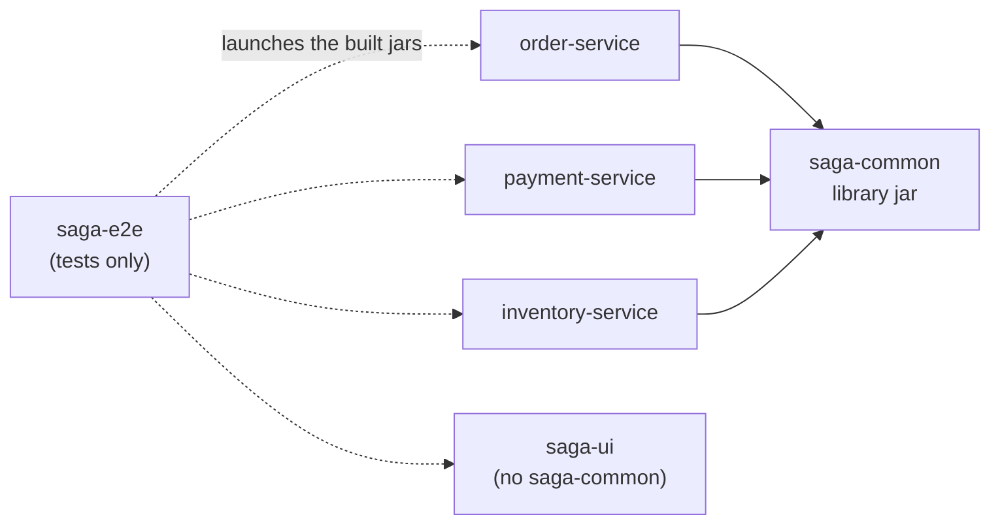

# Codebase tour

Where everything lives, how one order travels through the classes, and how to extend the system. Read [Architecture](ARCHITECTURE.md) first for the *why*.

- [1. Modules](#1-modules)
- [2. Package layout and the `com.saga` root](#2-package-layout-and-the-comsaga-root)
- [3. One order through the code](#3-one-order-through-the-code)
- [4. File index](#4-file-index)
- [5. The tests](#5-the-tests)
- [6. How to extend](#6-how-to-extend)
- [7. Conventions and gotchas](#7-conventions-and-gotchas)

---

## 1. Modules



| Module | Packaging | Depends on | Key dependencies |
|---|---|---|---|
| `saga-common` | plain jar | – | data-jpa, kafka, json, spring-boot-actuator, oauth2-resource-server |
| `order-service` | Boot jar | saga-common | webmvc, validation, actuator, flyway, postgresql, micrometer-registry-prometheus |
| `payment-service` | Boot jar | saga-common | webmvc, validation, actuator, flyway, postgresql |
| `inventory-service` | Boot jar | saga-common | same as payment |
| `saga-ui` | Boot jar | – | webmvc, kafka, actuator, security, oauth2-client (no database) |
| `saga-e2e` | test only | the four jars (for build order) | testcontainers-postgresql/-kafka, kafka-clients, jackson, awaitility |

All six modules inherit from the root [`pom.xml`](../pom.xml) (`saga-parent`, itself a child of `spring-boot-starter-parent` 4.0.6, Java 21). Versions come from Boot's dependency management; no module pins its own.

---

## 2. Package layout and the `com.saga` root

Every service's main class sits in the **root package `com.saga`**: `com.saga.OrderServiceApplication`, `com.saga.PaymentServiceApplication`, `com.saga.InventoryServiceApplication`. The shared library lives under `com.saga.common`. Spring Boot scans components, JPA entities and repositories from the main class's package downward, so each service automatically picks up `saga-common`'s outbox, idempotency, Kafka config and endpoints, with no `@EntityScan` or `scanBasePackages`.

**Consequence:** two services can't run in one JVM (each would scan the other's beans). That's why the e2e tests launch real processes ([section 5](#5-the-tests)).

```
com.saga
├── OrderServiceApplication / PaymentServiceApplication / InventoryServiceApplication
├── common                      (saga-common)
│   ├── messaging               message records, codec, topics, NonRetryableMessageException
│   ├── outbox                  OutboxMessage, OutboxWriter, OutboxRelay, OutboxEndpoint
│   ├── idempotency             ProcessedMessage, IdempotencyGuard
│   ├── security                SagaSecurityConfig (the access rulebook for all three services)
│   ├── kafka                   KafkaErrorHandlingConfig (retry/DLT), RetryProperties
│   │   └── dlt                 DltEndpoint, DltReplayer
│   └── SagaCommonConfig        @EnableScheduling + topic creation
├── order                       (order-service)
│   ├── api                     OrderController, OrderService, request/response records
│   ├── domain                  Order entity
│   └── saga                    OrderSaga, orchestrator, timeouts, alerting, stuck endpoint
│       └── intervention        retry/resolve service + audit entity
├── payment                     (payment-service)
│   ├── PaymentCommandHandler
│   ├── api                     CustomerController, PaymentController
│   └── domain                  CustomerCredit, Payment
├── inventory                   (inventory-service)
│   ├── InventoryCommandHandler
│   ├── api                     ProductController, ReservationController
│   └── domain                  Product, Reservation
└── ui                          (saga-ui) SagaUiApplication, ProxyController, InjectController,
                                UiSecurityConfig, MeController
```

---

## 3. One order through the code

Follow `POST /orders` for a successful order. Each step names the class and method.

**order-service: accept the order**
1. [`OrderController.create`](../order-service/src/main/java/com/saga/order/api/OrderController.java) validates the [`CreateOrderRequest`](../order-service/src/main/java/com/saga/order/api/CreateOrderRequest.java) record (Bean Validation).
2. [`OrderService.create`](../order-service/src/main/java/com/saga/order/api/OrderService.java), in **one** `@Transactional` method:
   - saves `new Order(...)` (status PENDING);
   - saves `new OrderSaga(orderId, now + saga.timeout.payment)` (state PAYMENT_PENDING, with the deadline);
   - calls `OutboxWriter.write(Topics.PAYMENT_COMMANDS, orderId, new ProcessPayment(...))`.
3. [`OutboxWriter.write`](../saga-common/src/main/java/com/saga/common/outbox/OutboxWriter.java) (`Propagation.MANDATORY`) serializes the record with [`MessageCodec`](../saga-common/src/main/java/com/saga/common/messaging/MessageCodec.java) and saves an [`OutboxMessage`](../saga-common/src/main/java/com/saga/common/outbox/OutboxMessage.java). The row's id becomes the `messageId`.
4. The transaction commits and the controller returns 201.

**order-service: publish**
5. [`OutboxRelay.publishPending`](../saga-common/src/main/java/com/saga/common/outbox/OutboxRelay.java) (`@Scheduled`, 500 ms):
   - `OutboxRepository.lockUnpublishedBatch` locks the rows (`FOR UPDATE SKIP LOCKED`);
   - `KafkaTemplate.send` sends each one with the `messageId` and `messageType` headers, keyed by orderId;
   - the relay waits for every acknowledgement, then calls `markPublished`.

**payment-service: process the command**
6. [`PaymentCommandHandler.onCommand`](../payment-service/src/main/java/com/saga/payment/PaymentCommandHandler.java) (`@KafkaListener(topics = payment.commands)`, `@Transactional`):
   - `MessageCodec.decode(record)` → an `InboundMessage(messageId, payload)`;
   - [`IdempotencyGuard.firstDelivery(messageId)`](../saga-common/src/main/java/com/saga/common/idempotency/IdempotencyGuard.java) → `ProcessedMessageRepository.markProcessed` (`INSERT … ON CONFLICT DO NOTHING`); a duplicate returns here;
   - a `switch` on the payload → `process(ProcessPayment)`:
     - `PaymentRepository.findByOrderIdForUpdate`: a fence or duplicate check;
     - `CustomerCreditRepository.findForUpdate`: row lock;
     - `CustomerCredit.debit`, then save `new Payment(...)` (COMPLETED);
   - `OutboxWriter.write(Topics.SAGA_REPLIES, orderId, new PaymentProcessed(...))`.
7. payment-service's own `OutboxRelay` publishes the reply to `order.saga.replies`.

**order-service: advance the saga**
8. [`OrderSagaOrchestrator.onReply`](../order-service/src/main/java/com/saga/order/saga/OrderSagaOrchestrator.java) (`@KafkaListener(topics = order.saga.replies)`, `@Transactional`):
   - decodes and checks idempotency;
   - loads the saga (an unknown saga throws `NonRetryableMessageException`, sending the reply to the DLT);
   - **state guard:** `expectedState(reply)` must equal the saga's state, otherwise the reply is logged and ignored;
   - `switch (reply)` → `case PaymentProcessed` → `saga.paymentCompleted(now + inventory timeout)` and `sendReserveInventory`.
9. inventory-service: [`InventoryCommandHandler.reserve`](../inventory-service/src/main/java/com/saga/inventory/InventoryCommandHandler.java) does the same pattern (lock the product, decrement, save a `Reservation`, reply `InventoryReserved`).
10. order-service: `onReply` → `case InventoryReserved` → `saga.inventoryReserved()` (COMPLETED, deadline cleared) and `order.approve()`.

**When things go wrong** (the same classes, other branches):

| Event | Code path |
|---|---|
| Deadline passed | [`SagaTimeoutScanner.timeOutOverdueSagas`](../order-service/src/main/java/com/saga/order/saga/SagaTimeoutScanner.java) → `OrderSagaRepository.findOverdueIds` → per saga, in its own transaction, `OrderSagaOrchestrator.onTimeout` |
| Compensation re-sent | `OrderSaga.resendCompensation` → `OrderSagaOrchestrator.sendCompensation`. After commit, [`CompensationMonitor.compensationResent`](../order-service/src/main/java/com/saga/order/saga/CompensationMonitor.java) logs and counts |
| Handler throws | Spring Kafka `DefaultErrorHandler` from [`KafkaErrorHandlingConfig.kafkaErrorHandler`](../saga-common/src/main/java/com/saga/common/kafka/KafkaErrorHandlingConfig.java): retries, then `DeadLetterPublishingRecoverer` |
| Operator action | [`StuckSagasEndpoint.intervene`](../order-service/src/main/java/com/saga/order/saga/StuckSagasEndpoint.java) → [`SagaInterventionService.intervene`](../order-service/src/main/java/com/saga/order/saga/intervention/SagaInterventionService.java) |
| DLT replay | [`DltEndpoint.replay`](../saga-common/src/main/java/com/saga/common/kafka/dlt/DltEndpoint.java) → [`DltReplayer.replay`](../saga-common/src/main/java/com/saga/common/kafka/dlt/DltReplayer.java) |

---

## 4. File index

### saga-common
| Class | Responsibility |
|---|---|
| `messaging/SagaCommand`, `SagaReply` | Sealed interfaces holding every message record. **The message contract** |
| `messaging/MessageCodec` | JSON serialization. The type registry is built from the sealed permits. Decodes `ConsumerRecord` → `InboundMessage` and throws `NonRetryableMessageException` for malformed input |
| `messaging/Topics` | Topic names, header names, `dlt(topic)` |
| `outbox/OutboxWriter` | Insert an outgoing message in the caller's transaction (MANDATORY) |
| `outbox/OutboxRelay` | Scheduled publisher, `SKIP LOCKED` batches, at-least-once |
| `outbox/OutboxEndpoint` | Actuator `outbox/{key}`: the messages emitted for an order |
| `idempotency/IdempotencyGuard` | `firstDelivery(messageId)`, via `processed_message` |
| `kafka/KafkaErrorHandlingConfig` | `DefaultErrorHandler` + exponential backoff + DLT + not-retryable exceptions + retry logging |
| `kafka/RetryProperties` | `saga.kafka.retry.*` |
| `kafka/dlt/DltEndpoint`, `DltReplayer` | Actuator `dlt`: pending counts and replay, scoped to this service's listeners |
| `SagaCommonConfig` | `@EnableScheduling`; declares the 3 topics + 3 DLTs (3 partitions, DLT retention 14 days) |
| `security/SagaSecurityConfig` | OAuth2 resource-server `SecurityFilterChain`: who may call which method + path (public / viewer / operator / admin / metrics), stateless, deny by default |

### order-service
| Class | Responsibility |
|---|---|
| `api/OrderController`, `OrderService` | `POST /orders`, `GET /orders`, `GET /orders/{id}`; creates the order, saga and first command in one transaction |
| `domain/Order` | Order entity: `approve()`, `reject(reason)`, `@Version` |
| `saga/SagaState` | The six states; `isTerminal()`, `isCompensating()` |
| `saga/OrderSaga` | Saga entity: guarded transition methods, deadline, compensation tracking, `@Version` |
| `saga/OrderSagaOrchestrator` | **The state machine.** `onReply` (Kafka), `onTimeout` (scanner), `sendCompensation` |
| `saga/SagaTimeoutScanner` + `SagaTimeoutProperties` | Times out overdue sagas (`saga.timeout.*`) |
| `saga/CompensationMonitor` + `SagaAlertProperties` | Stuck threshold, the log line, Micrometer gauges and counter (`saga.alert.*`) |
| `saga/StuckSagasEndpoint` | Actuator `stucksagas`: list, detail, retry/resolve |
| `saga/intervention/*` | `SagaInterventionService` (retry/resolve), the `SagaIntervention` audit entity, response records |
| `OrderSagaRepository` | Overdue query, stuck projection, compensation stats for the gauges |

### payment-service / inventory-service
| Class | Responsibility |
|---|---|
| `PaymentCommandHandler` | `process` (charge, or refuse via the fence) and `refund` (idempotent; leaves a CANCELLED tombstone if there's nothing to refund) |
| `domain/CustomerCredit`, `Payment`, `PaymentStatus` | Credit with `debit`/`credit`; payment COMPLETED/REFUNDED/CANCELLED; `Payment.cancelled(orderId)` tombstone |
| `api/CustomerController`, `PaymentController` | Read APIs and the credit seed `PUT` |
| `InventoryCommandHandler` | `reserve` and `release` (idempotent; leaves a RELEASED tombstone) |
| `domain/Product`, `Reservation`, `ReservationStatus` | Stock with `reserve`/`release`; `Reservation.tombstone(...)` |
| `api/ProductController`, `ReservationController` | Read APIs and the stock seed `PUT` |

### saga-ui
| File | Responsibility |
|---|---|
| `ProxyController` | `/api/{order\|payment\|inventory}/**` pass-through via `RestClient.exchange`, adding the signed-in user's access token (from `OAuth2AuthorizedClientManager`, which refreshes it); 502 JSON when a service is unreachable |
| `UiSecurityConfig` | OIDC login (`oauth2Login`), Keycloak logout, `csrf.spa()`, 401-with-marker-header for `/api/**`, `saga-operator` for `/api/inject`, maps the ID token's `roles` claim to `ROLE_*` |
| `MeController` | `GET /api/me`: username, name and saga roles of the signed-in user (read from the authentication, where the mapped roles live) |
| `InjectController` | `POST /api/inject`: raw records to the 3 saga topics in the services' wire format |
| `UiProperties` | `saga.ui.services.*` base URLs |
| `static/index.html`, `styles.css`, `app.js` | The page. Vanilla JS, no build step. `derivePath` reconstructs the route from the timeline; `renderMap` draws the transit-map SVG; `refreshDetail` merges the three outboxes into the timeline |

### Configuration and ops
| Path | Contents |
|---|---|
| `*/src/main/resources/application.yml` | Ports, datasource, Kafka, retry, timeout and alert settings, exposed actuator endpoints |
| `*/src/main/resources/db/migration/V*__*.sql` | Flyway migrations, per service (listed in [PROJECT.md](../PROJECT.md#database-migrations-flyway)) |
| `docker-compose.yml`, `docker/postgres/init.sql` | Local development infrastructure: Postgres, Kafka, AKHQ, Keycloak |
| `docker/keycloak/saga-realm.json` | The `saga` realm (roles, clients, dev users). `${VAR:default}` placeholders let a deployment set the console URL, secrets and passwords |
| `docker/app.Dockerfile`, `docker/keycloak/Dockerfile`, `docker/postgres/Dockerfile`, `.dockerignore` | Deployment images: one layered, non-root image per Spring Boot module; Keycloak with the realm baked in; Postgres with the init script |
| `ops/images.cmd` | Package + build the six images, optionally push (`SAGA_REGISTRY`, default `ghcr.io/srikanthkaushik`) |
| `deploy/unraid/` | `docker-compose.yml`, `.env.example` and guide for running the stack from images (Unraid Compose Manager or any Docker host) |
| `ops/prometheus/saga-alerts.yml`, `saga-alerts.test.yml` | Alert rules and their promtool tests |
| `ops/RUNBOOK.md` | Operator procedures |

---

## 5. The tests

Everything is tested end-to-end in **`saga-e2e`**. There are no per-service unit or slice tests yet (an open item in PROJECT.md).

| File | Role |
|---|---|
| [`SagaEndToEndIT`](../saga-e2e/src/test/java/com/saga/e2e/SagaEndToEndIT.java) | 23 tests (mapped to scenarios in [SCENARIOS.md › Scenario 14](SCENARIOS.md#scenario-14--the-automated-suite)) |
| [`ServiceProcess`](../saga-e2e/src/test/java/com/saga/e2e/ServiceProcess.java) | Starts a jar as a child JVM on a free port with `--property=value` overrides, waits for `/actuator/health`, logs to `target/e2e-logs/<name>.log` |
| [`KafkaProbe`](../saga-e2e/src/test/java/com/saga/e2e/KafkaProbe.java) | Sends raw records (any headers, any partition) and waits for a given `messageId` on a DLT |
| [`KeycloakSupport`](../saga-e2e/src/test/java/com/saga/e2e/KeycloakSupport.java) | Keycloak Testcontainer with the same realm file as docker-compose; tokens per dev user (cached a minute), client-credentials and wrong-realm tokens; points the console client's redirect URI at the console's random port |
| [`ConsoleSession`](../saga-e2e/src/test/java/com/saga/e2e/ConsoleSession.java) | A scripted browser: follows the OIDC redirect, submits Keycloak's login form, keeps cookies (treating `Secure` cookies like a browser on localhost) and sends requests with or without the CSRF header |

How the suite works:
- `@Testcontainers` starts Postgres 17 (with `docker/postgres/init.sql`) and `apache/kafka:4.0.0`.
- `@BeforeAll` launches order, payment, inventory and the console, pointed at those containers with fast settings.
- **Isolation:** each test seeds its own customer and product with UUID ids over JDBC.
- **Fault injection:**
  - poison records on every partition (to stall a participant past a timeout);
  - Postgres triggers that make refunds fail or block their reply (for stuck and intervention tests).
- **Ordering:** those tests run last via `@Order(AFTER_EVERYTHING_ELSE)`, so the replay tests don't replay their poison records.

Run it with `mvn clean verify`. The promtool tests for the alert rules are separate ([Getting started §8](GETTING-STARTED.md#8-run-the-tests)).

---

## 6. How to extend

### Add a saga step (e.g. a shipping service)
1. **Contract** ([`SagaCommand`](../saga-common/src/main/java/com/saga/common/messaging/SagaCommand.java) / [`SagaReply`](../saga-common/src/main/java/com/saga/common/messaging/SagaReply.java)): add records such as `ScheduleShipment` and `CancelShipment`, plus the replies `ShipmentScheduled`, `ShipmentFailed` and `ShipmentCancelled`. Add them to the `permits` list. `MessageCodec` registers them automatically.
2. **Topic:** add `SHIPPING_COMMANDS` to [`Topics`](../saga-common/src/main/java/com/saga/common/messaging/Topics.java) and to `Topics.ALL`. `SagaCommonConfig` then creates the topic and its DLT.
3. **Compile.** The exhaustive `switch (reply)` and `expectedState` in `OrderSagaOrchestrator` now fail to compile until the new replies are handled. That's deliberate.
4. **States:** add the new states to `SagaState` (and to `isCompensating()` if it's a compensating state). Add guarded transition methods to `OrderSaga`, cases in `onTimeout`, and a `saga.timeout.shipping` property.
5. **The participant:** a new module modeled on payment-service, with:
   - main class in `com.saga`;
   - `@KafkaListener` + `@Transactional` + `IdempotencyGuard.firstDelivery` + `OutboxWriter`;
   - a business-key unique constraint on `order_id`;
   - an idempotent compensation that writes a tombstone when there's nothing to undo;
   - Flyway `V1__init.sql` including `outbox` and `processed_message`.
6. **Tests:** add the e2e cases. If you want the console to show it, add a station and tracks to `STATIONS`/`TRACKS` in `app.js`.

### Protect a new endpoint
Add its method and path to the rulebook in [`SagaSecurityConfig`](../saga-common/src/main/java/com/saga/common/security/SagaSecurityConfig.java), at the right role, before `anyRequest().denyAll()`. Until you do, it is denied (403), which is the safe default. If it needs a new role:
- add the role to `docker/keycloak/saga-realm.json`, including the composite it belongs to;
- grant it to the right dev users;
- add a row to the e2e role matrix (`services_enforceRolesPerEndpoint`).

If the console exposes it, gate the button in `applyRoleGates` in `app.js`.

### Add a configuration property
Follow the `@ConfigurationProperties` record pattern with `@DefaultValue` (see `SagaTimeoutProperties`), and register it in the main class's `@EnableConfigurationProperties`. Add it to `application.yml` and to the configuration table in PROJECT.md.

### Add a database change
Add a **new** file `V<next>__description.sql` in that service's `db/migration`. Never edit an applied migration (Flyway validates checksums). JPA runs with `ddl-auto: validate`, so the entity and the migration must agree or the service won't start.

### Add an admin endpoint
Use an actuator `@Endpoint` (see `DltEndpoint` and `StuckSagasEndpoint`):
- optional parameters take jspecify `@Nullable`;
- write-operation parameters bind from the JSON body;
- return `WebEndpointResponse` to control the status code.

Then add its id to `management.endpoints.web.exposure.include`, and add it to the console's `CATALOGUE` in `app.js`.

---

## 7. Conventions and gotchas

**Rules every handler follows**
- **Never call Kafka from business code.** Always `OutboxWriter.write` inside the business transaction.
- **Every listener:** `@Transactional` → `codec.decode` → `idempotencyGuard.firstDelivery` → business change → `outbox.write` (reply).
- **Permanent failures** throw `NonRetryableMessageException`. Anything else is treated as transient and retried.
- **Compensations must be idempotent and always reply**, even when there's nothing to undo; leave a tombstone in that case.
- **Key every message by orderId.**

**Security rules**
- **Every endpoint gets a rule** in `SagaSecurityConfig`; anything unlisted is denied.
- **Never trust identity from a request body.** Use the authenticated principal (`preferred_username`).
- **Keep the Keycloak URL identical everywhere** (`http://localhost:8180`), because it becomes the token issuer.
- **Console calls:** state-changing calls from the page must send `X-XSRF-TOKEN`; `call()` in `app.js` does it.

**Boot 4 specifics that will bite** (full list in [PROJECT.md](../PROJECT.md#boot-4-gotchas-verified))
- Starters are renamed: `spring-boot-starter-webmvc`, `spring-boot-starter-kafka`, `spring-boot-starter-flyway` (+ `flyway-database-postgresql`).
- Jackson 3: package `tools.jackson`, inject `JsonMapper`, `asText()` is now `asString()`, exceptions are unchecked.
- Spring Kafka's default DLT suffix is `-dlt`.
- **Don't put `@Validated` on controllers.** Spring MVC validates constraint-annotated parameters itself (400). Class-level `@Validated` turns the same violations into 500s.

**Windows/CMD**
- Commands in the docs are CMD.
- In Git Bash, prefix `docker exec … /opt/...` with `MSYS_NO_PATHCONV=1`.
- `mvn clean` can't delete a jar a running service is using.
